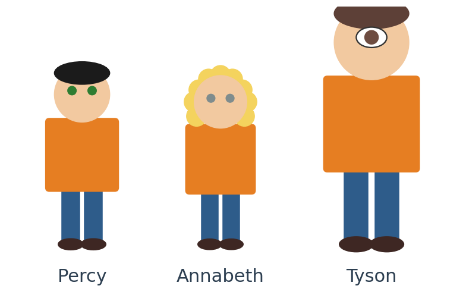
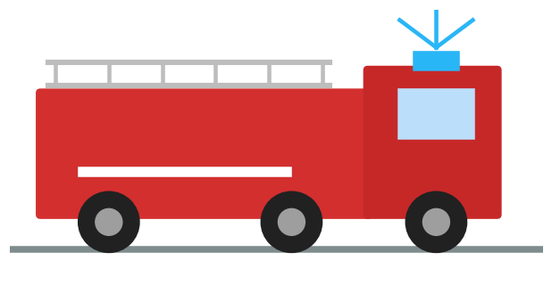
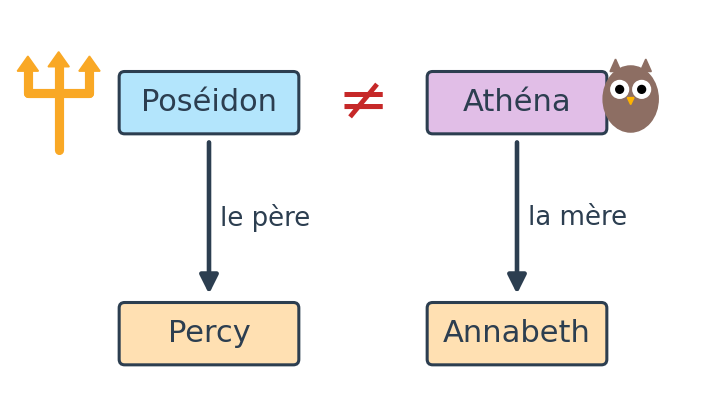
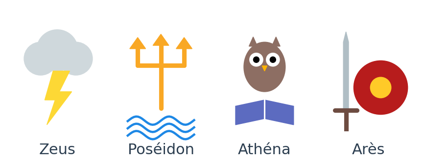
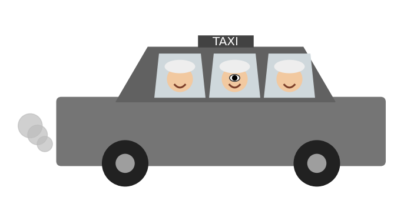

<!-- _paginate: false -->

# Percy Jackson : le taxi magique

Une énigme en français, niveau A1

---

## La mission

<div class="cols2">
<div>

Percy, Annabeth et Tyson sont en danger. Ils doivent appeler un taxi magique.

Pour appeler le taxi, il faut un mot de passe.

. 7 activités
. chaque activité donne 1 lettre
. les 7 lettres forment le mot de passe

</div>
<div>



</div>
</div>

---

## Activité 1 : écoute (1/2)

<div class="small">

Écoute le professeur. Suis le texte.

Rick Riordan, Percy Jackson, La Mer des monstres, chapitre 3 : « Nous hélons le taxi du tourment éternel »

Annabeth nous attendait dans une ruelle adjacente. Elle nous a tirés par le bras, Tyson et moi, au moment où le camion des pompiers déboulait dans la rue, toutes sirènes hurlantes, en fonçant vers Meriwether.

– Où tu l'as trouvé, celui-là ? m'a-t-elle demandé en montrant Tyson du doigt.

Je dois vous dire qu'en n'importe quelles autres circonstances, j'aurais été hyper heureux de la voir. Nous avions fait la paix l'été dernier, surmontant le fait que sa mère, Athéna, ne s'entendait pas bien avec mon père, Poséidon. Annabeth m'avait sans doute plus manqué que je ne voulais bien l'admettre.

</div>

---

## Activité 1 : écoute (2/2)

<div class="small">

Seulement là, je venais de me faire attaquer par des géants cannibales, Tyson m'avait sauvé la vie trois ou quatre fois et tout ce qu'elle trouvait à faire, c'était de le reluquer d'un œil mauvais comme si la source de tous nos problèmes, c'était lui.

– C'est mon ami, ai-je répondu.

– Est-ce qu'il est sans abri ?

– Quel rapport ? Il t'entend, tu sais, il n'est pas sourd. Tu peux lui poser la question directement.

</div>

---

## Activité 1 : questions

<div class="cols2">
<div>

Écoute encore. Réponds.

1. Coche les noms que tu entends :
. Annabeth . Tyson . Hermès
. Athéna . Zeus . Poséidon

2. Vrai ou faux ?
. Annabeth attend dans une petite rue.
. Il y a un camion de pompiers.
. Tyson n'entend pas, il est sourd.

Tout est juste ? Le professeur donne la lettre !

</div>
<div>



</div>
</div>

---

## Activité 2 : lecture

Lis le texte.

Annabeth attend dans une petite rue. Elle prend Percy et Tyson par le bras.

Annabeth demande : « Qui est-ce ? »
Percy répond : « C'est mon ami Tyson. »

Annabeth est la fille d'Athéna. Percy est le fils de Poséidon. Athéna et Poséidon ne sont pas amis.

Question : qui est la mère d'Annabeth ?

. A. Athéna → lettre R
. B. Poséidon → lettre M
. C. Tyson → lettre S

---

## Activité 3 : grammaire, mon / ma

<div class="cols2">
<div>

Percy parle. Complète avec mon ou ma.

. 1. Poséidon est ___ père.
. 2. Annabeth est ___ amie.
. 3. Tyson est ___ ami.

Annabeth parle. Complète avec mon ou ma.

. 4. Athéna est ___ mère.

Question : phrase 1, Poséidon est ___ père ?

. A. ma → lettre O
. B. mon → lettre I

</div>
<div>



</div>
</div>

---

## Activité 4 : l'image

<div class="cols2">
<div>


</div>
<div>

Voici Tyson. Décris Tyson.

. Il est grand ou petit ?
. Il a les cheveux de quelle couleur ?
. Il est content ou triste ?

Question : Tyson a combien d'yeux ?

. A. deux → lettre K
. B. un → lettre D
. C. trois → lettre P

</div>
</div>

---

## Activité 5 : dessin

Écoute le professeur et dessine le taxi magique.

« Le taxi est gris. Il est vieux et sale. Dans le taxi, il y a trois vieilles dames. Elles ont un seul œil pour les trois ! »

Montre ton dessin. Explique : « Le taxi est… Il y a… »

Le dessin est juste ? Le professeur donne la lettre !

---

## Activité 6 : écriture

Tu es un demi-dieu, comme Percy ! Présente-toi en 3 phrases.

```
Je m'appelle ...
Mon père / Ma mère est ... (un dieu ou une déesse)
J'aime ...
```

Exemple : Je m'appelle Léa. Ma mère est Athéna. J'aime les livres.

Trois phrases correctes ? Le professeur donne la lettre !

---

## Activité 7 : les dieux

Regarde les symboles. Relie le dieu et son domaine.



```
Zeus        .     . la mer
Poséidon    .     . la guerre
Athéna      .     . le ciel
Arès        .     . l'intelligence
```

Question : Poséidon, c'est le dieu de…

. A. la mer → lettre T
. B. le ciel → lettre V

---

## Le mot de passe

<div class="cols2 wide-left">
<div>

Écris les 7 lettres dans l'ordre des activités :

```
 1   2   3   4   5   6   7
 _   _   _   _   _   _   _
```

Quel est le mot ? C'est l'arme d'un dieu…

</div>
<div>


</div>
</div>

---

<!-- _paginate: false -->

# Bravo !

Le taxi magique arrive. Percy, Annabeth et Tyson sont sauvés !



Tu parles bien français, demi-dieu.
