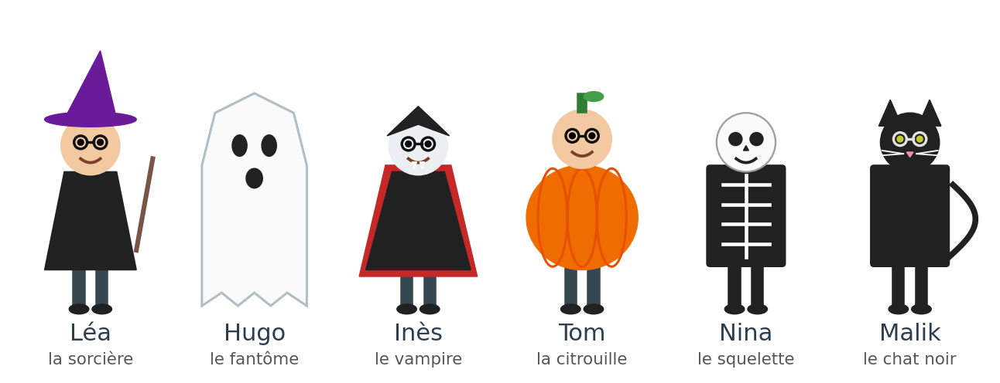
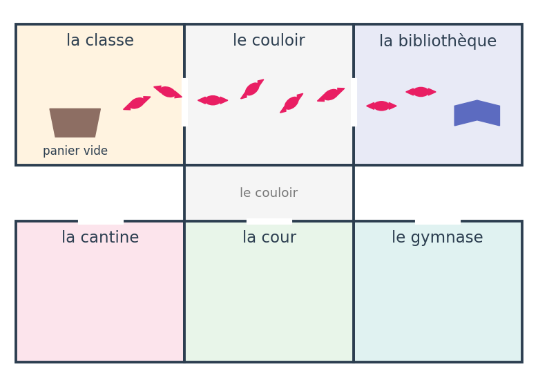
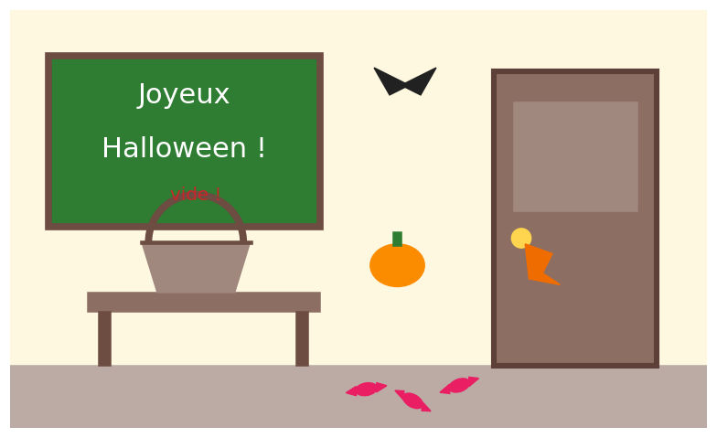

## L'enquête commence

C'est le jour d'Halloween. Toute la classe est déguisée.

Ce matin, la maîtresse a apporté un grand panier de bonbons. Mais à 10 heures… le panier est vide !

Quelqu'un a pris les bonbons. Six élèves sont suspects.

Ta mission : trouver le coupable, comme un vrai détective.

À chaque activité, tu trouves un indice. Barre les suspects qui ne correspondent pas !

## Les suspects

{width="1150"}

## La fiche d'enquête

Recopie la fiche. Complète-la pendant l'enquête.

| Suspect | Lunettes ? | Où à 10 h ? | Couleur du costume | Barré ? |
|---|---|---|---|---|
| Léa | | | | |
| Hugo | | | | |
| Inès | | | | |
| Tom | | | | |
| Nina | | | | |
| Malik | | | | |

## Indice 1 : le témoin (lecture) {.smaller}

Lis le témoignage du gardien.

« Je m'appelle Monsieur Bernard, je suis le gardien de l'école. Ce matin, à 10 heures, je lavais les fenêtres du couloir. Tout à coup, j'ai entendu un bruit dans la classe. Un enfant déguisé est sorti en courant. Je n'ai pas vu son visage, mais j'ai vu ses lunettes briller ! Il tenait un gros paquet dans ses bras. Ensuite, il a disparu au bout du couloir. »

- Qui parle ? Que faisait-il à 10 heures ?
- Qu'est-ce que le gardien a entendu ? Qu'est-ce qu'il a vu ?
- Indice : le voleur porte… ?

Regarde les suspects : barre ceux qui n'ont pas ce détail.

## Indice 2 : le plan de l'école {.smaller}

:::: {.columns}
::: {.column width="60%"}

:::
::: {.column width="40%"}
Suis les papiers de bonbons, depuis le panier vide.

Dans quelle pièce est allé le voleur ?

Le carnet de la maîtresse, à 10 heures :

- Léa aide à la cantine.
- Hugo joue dans la cour.
- Inès range des livres à la bibliothèque.
- Tom lit à la bibliothèque.
- Nina fait du sport au gymnase.
- Malik joue dans la cour.

Barre les suspects qui étaient ailleurs.
:::
::::

## Indice 3 : la scène du vol (image)

:::: {.columns}
::: {.column width="60%"}

:::
::: {.column width="40%"}
Observe bien l'image. Trouve 3 indices.

Un indice est accroché à la porte : de quelle couleur est-il ?

Barre le dernier suspect !
:::
::::

## Activité 4 : préparer l'interrogatoire (grammaire)

Tu vas interroger le suspect. Écris 3 questions.

- une question avec où
- une question avec pourquoi
- une question avec est-ce que

Exemple : Où es-tu allé à 10 heures ?

N'oublie pas : une question commence par une majuscule et finit par un point d'interrogation.

## Activité 5 : l'interrogatoire (oral)

Le professeur joue le rôle du suspect.

Pose tes questions à voix haute. Écoute bien les réponses.

- Est-ce que le suspect dit la vérité ?
- Pourquoi a-t-il pris les bonbons ?

## Activité 6 : l'accusation (écriture)

Écris ton accusation, comme au Cluedo :

```
C'est ............, déguisé en ............,
qui a pris les bonbons.
Il était dans ............ .
Je le sais parce que ............
et parce que ............ .
```

Lis ton accusation à voix haute !

## Activité 7 : la fête (dessin)

Le voleur avait une bonne raison… Il voulait cacher les bonbons pour une fête surprise !

Dessine l'affiche de la fête d'Halloween de la classe.

Écris sur ton affiche : le jour, l'heure et le lieu de la fête.

# Bravo, détective !

Tu as résolu le mystère des bonbons d'Halloween.

Joyeux Halloween !
