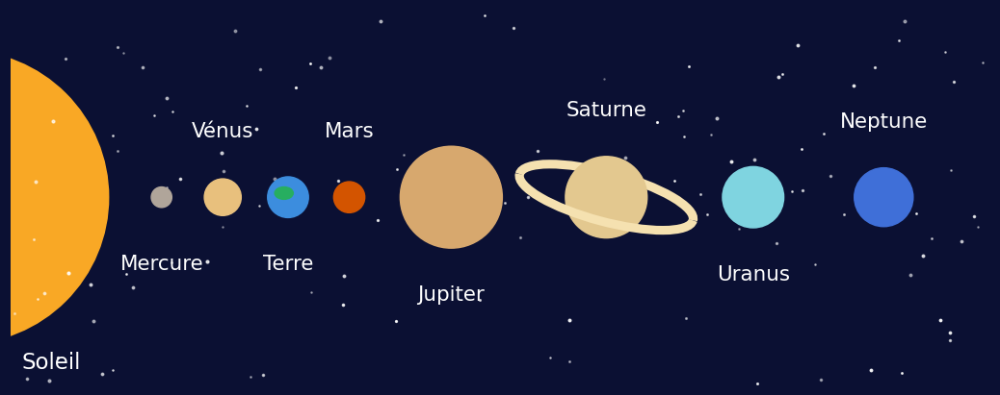
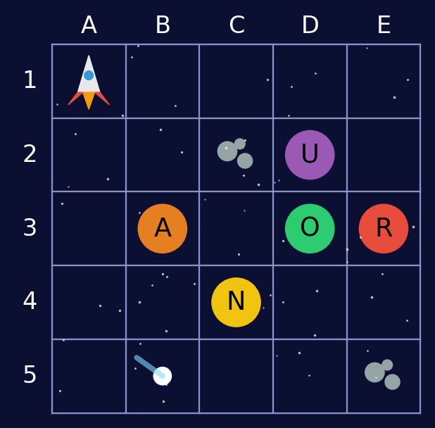
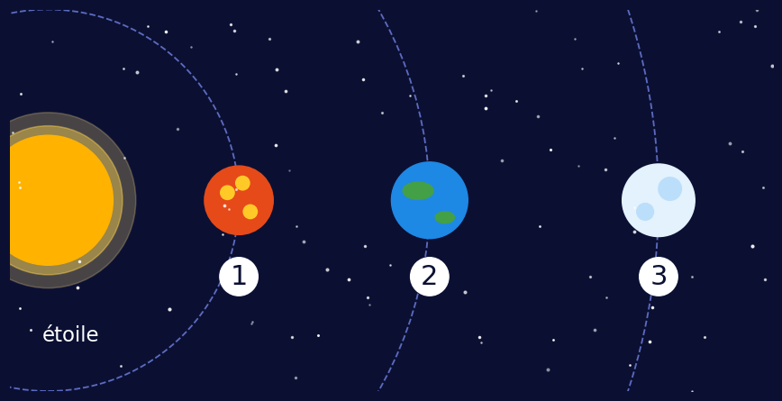

## Pad de la séance

<https://semestriel.framapad.org/p/5iq1ap1qri-anup?lang=fr>

## Message urgent ! {.smaller}

:::: {.columns}
::: {.column width="60%"}
Bonjour, je m'appelle Zip. Je suis un petit robot explorateur.

Mon vaisseau est en panne au milieu de l'espace. Pour redémarrer, il me faut un mot de passe secret.

Chaque énigme résolue te donne une lettre. Avec les 6 lettres, tu trouveras le mot de passe !

Es-tu prêt ou prête à m'aider ?
:::
::: {.column width="40%"}
{height="340"}
:::
::::

## Énigme 1 : lecture

::: {.smaller}
Lis le message de Zip :

« Je cherche une exoplanète. Une exoplanète, c'est une planète qui tourne autour d'une autre étoile que le Soleil. Il y en a des milliers dans l'univers ! Certaines sont brûlantes, d'autres sont gelées. Moi, je cherche une planète avec de l'eau. »
:::

Question : autour de quoi tourne une exoplanète ?

- A. autour du Soleil → lettre M
- B. autour d'une autre étoile → lettre É
- C. autour de la Lune → lettre K

## Énigme 2 : observe l'image

:::: {.columns}
::: {.column width="50%"}
{height="300"}
:::
::: {.column width="50%"}
Voici les planètes qui tournent autour de notre Soleil.

Question : quelle planète a de grands anneaux ?

- A. Mars → lettre R
- B. Saturne → lettre T
- C. la Terre → lettre S

Bonus : combien de planètes comptes-tu ?
:::
::::

## Énigme 3 : la carte de la galaxie {.smaller}

:::: {.columns}
::: {.column width="50%"}
{height="440"}
:::
::: {.column width="50%"}
Pars de la fusée, dans la case A1.

- Avance de 3 cases vers la droite →
- Puis descends de 2 cases ↓

Sur quelle planète arrives-tu ? Sa lettre est la lettre de l'énigme !

Bonus : dans quelle case se trouve la comète ?
:::
::::

## Énigme 4 : à l'oral

Lire les 3 devinettes. Et répondre à voix haute !

- Je suis ronde, je brille la nuit et je tourne autour de la Terre. Qui suis-je ?
- Je brille dans le ciel la nuit. Le Soleil en est une ! Qui suis-je ?
- Je décolle avec beaucoup de bruit et j'emmène les astronautes dans l'espace. Qui suis-je ?

Trois bonnes réponses ? Ton professeur te donne la lettre !

## Énigme 5 : à l'écrit

Les lettres sont mélangées ! Écris les mots dans le bon ordre :

- N U L E → _ _ _ _
- S R A M → _ _ _ _
- L I E L O S → _ _ _ _ _ _

La lettre de l'énigme est la première lettre du premier mot.

Puis écris une phrase : « Sur ma planète idéale, il y a … »

## Énigme 6 : quelle planète pour Zip ? {.smaller}

:::: {.columns}
::: {.column width="50%"}
{height="300"}
:::
::: {.column width="50%"}
Zip a trouvé trois exoplanètes autour d'une étoile.

- La planète 1 est très près de l'étoile : elle est brûlante.
- La planète 3 est très loin : elle est toute gelée.
- La planète 2 n'est ni trop chaude, ni trop froide : l'eau peut y rester liquide.

Sur quelle planète Zip peut-il trouver de l'eau ?

- planète 1 → lettre F
- planète 2 → lettre E
- planète 3 → lettre G
:::
::::

## Le mot de passe

Écris tes 6 lettres dans l'ordre des énigmes :

```
 1   2   3   4   5   6
 _   _   _   _   _   _
```

Quel mot as-tu trouvé ?

# Bravo !

Le vaisseau de Zip redémarre. Direction l'exoplanète avec de l'eau !

Tu es un vrai astronaute.
